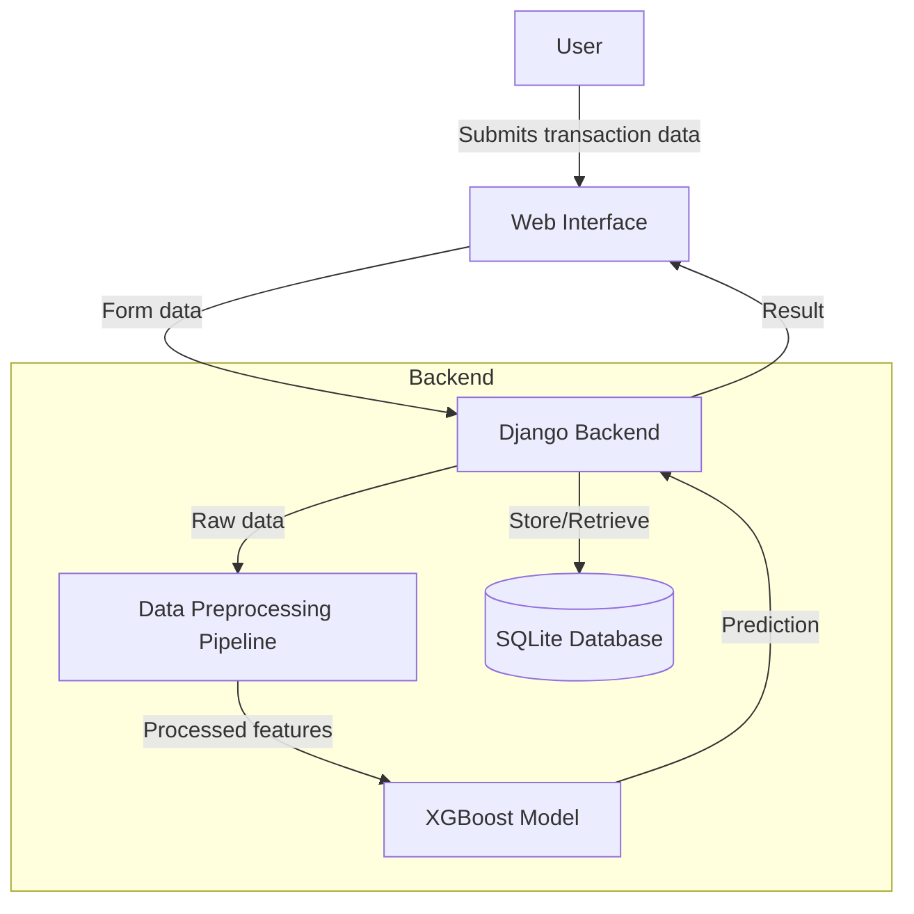

# Credit Card Fraud Detection System


A sophisticated web application built with Django that leverages machine learning to detect fraudulent credit card transactions in real-time. This system combines advanced preprocessing techniques with an XGBoost model to accurately predict whether a transaction is legitimate or potentially fraudulent.

## 📋 Table of Contents

- [Credit Card Fraud Detection System](#credit-card-fraud-detection-system)
  - [📋 Table of Contents](#-table-of-contents)
  - [✨ Features](#-features)
  - [🏗 System Architecture](#-system-architecture)
    - [Data Flow Architecture](#data-flow-architecture)
  - [🛠 Technology Stack](#-technology-stack)
  - [🔄 Data Processing Pipeline](#-data-processing-pipeline)
  - [📥 Installation \& Setup](#-installation--setup)
  - [🚀 Usage](#-usage)
  - [📁 Project Structure](#-project-structure)
  - [🔮 Future Enhancements](#-future-enhancements)
  - [👥 Contributing](#-contributing)

## ✨ Features

- **Interactive Web Interface**: User-friendly form to input transaction details
- **Advanced Data Preprocessing**: Transforms raw transaction data into model-ready features
- **Machine Learning Integration**: Leverages a pre-trained XGBoost model for high-accuracy fraud detection
- **Real-time Predictions**: Provides immediate feedback on transaction legitimacy
- **Testing Utilities**: Built-in tools to populate the form with sample fraudulent and legitimate transactions
- **Responsive Design**: Adapts to different screen sizes for optimal user experience

## 🏗 System Architecture

The system follows a classic Django MVC architecture with specialized components for ML operations:



### Data Flow Architecture

```mermaid
flowchart LR
    RawData[Raw Transaction Data] --> Clean[Data Cleaning]
    Clean --> CreditCard[Credit Card Categorization]
    CreditCard --> Age[Age Calculation]
    Age --> Distance[Distance Calculation]
    Distance --> Holiday[Holiday Distance]
    Holiday --> Encoding[Label Encoding]
    Encoding --> ColumnDropping[Column Dropping]
    ColumnDropping --> ProcessedData[Processed Features]
    ProcessedData --> XGBoost[XGBoost Model]
    XGBoost --> Prediction[Fraud/Not Fraud]

```



## 🛠 Technology Stack

- **Framework**: Django 4.0
- **Data Processing**: Pandas, NumPy, GeoPy
- **Machine Learning**: Scikit-learn, XGBoost
- **Frontend**: HTML, CSS, JavaScript
- **Database**: SQLite
- **Environment Management**: Python venv
- **Configuration**: python-decouple

## 🔄 Data Processing Pipeline

The application employs a sophisticated data processing pipeline to transform raw transaction data into features suitable for machine learning:

1. **Data Cleaning**: Converts date and time fields to appropriate formats
2. **Credit Card Type Classification**: Identifies card type based on number patterns (VISA, Mastercard, AMEX, JCB)
3. **Age Calculation**: Determines cardholder age from date of birth
4. **Geographical Analysis**: Calculates distance between cardholder and merchant locations
5. **Temporal Features**: Computes days to next holiday for detecting unusual spending patterns
6. **Categorical Encoding**: Transforms text data into numeric representations
7. **Feature Selection**: Removes personally identifiable information and redundant fields

## 📥 Installation & Setup

1. **Clone the repository**:
   ```bash
   git clone https://github.com/yourusername/credit-card-fraud-detection.git
   cd credit-card-fraud-detection
   ```

2. **Create a virtual environment**:
   ```bash
   python -m venv venv
   ```

3. **Activate the virtual environment**:
   - Windows:
     ```bash
     venv\Scripts\activate
     ```
   - macOS/Linux:
     ```bash
     source venv/bin/activate
     ```

4. **Install dependencies**:
   ```bash
   pip install -r requirements.txt
   ```

5. **Create a `.env` file** in the project root with:
   ```
   SECRET_KEY=your_secret_key_here
   ```

6. **Set up the database**:
   ```bash
   python manage.py migrate
   ```

7. **Run the development server**:
   ```bash
   python manage.py runserver
   ```

8. **Access the application** at `http://127.0.0.1:8000/fraud-detection/`

## 🚀 Usage

1. Navigate to the fraud detection form at `/fraud-detection/`
2. Input transaction details manually or use the pre-filled test data buttons:
   - "Fill Form with Fraudulent Data" - Populates the form with a known fraudulent transaction
   - "Fill Form with Non-Fraudulent Data" - Populates the form with a legitimate transaction
3. Submit the form to get the prediction result
4. The system will analyze the data and display whether the transaction is classified as "Fraud" or "Not Fraud"

## 📁 Project Structure

```
CreditCardFraudDetection/
├── ColumnTransformer/           # Custom transformers for data preprocessing
│   └── Transformers.py          # Functions for data transformation
├── CreditCardFraudApp/          # Main Django project directory
│   ├── settings.py              # Project settings
│   ├── urls.py                  # Main URL configuration
│   └── wsgi.py                  # WSGI configuration
├── FraudDetection/              # Fraud detection app
│   ├── templates/               # HTML templates
│   ├── forms.py                 # Form definitions
│   ├── models.py                # Data models
│   ├── urls.py                  # App URL configuration
│   └── views.py                 # View controllers
├── models/                      # ML model files (not shown in repo structure)
│   └── model_xgboost.json       # Pre-trained XGBoost model
├── static/                      # Static files (CSS, JS)
│   ├── css/                     # Stylesheets
│   └── js/                      # JavaScript files
├── templates/                   # Global templates
├── manage.py                    # Django management script
└── requirements.txt             # Project dependencies
```

## 🔮 Future Enhancements

- **Model Retraining Interface**: Add functionality to retrain the model with new data
- **User Authentication**: Implement user accounts to track usage and preferences
- **Transaction History**: Store and display historical transaction analyses
- **API Endpoint**: Create a REST API for programmatic access to fraud detection
- **Advanced Visualizations**: Add graphs and charts to visualize fraud patterns
- **Multi-model Ensemble**: Implement multiple models to improve accuracy

## 👥 Contributing

Contributions are welcome! To contribute:

1. Fork the repository
2. Create a feature branch (`git checkout -b feature/amazing-feature`)
3. Commit your changes (`git commit -m 'Add some amazing feature'`)
4. Push to the branch (`git push origin feature/amazing-feature`)
5. Open a Pull Request

Please ensure your code follows the project's coding standards and includes appropriate tests.